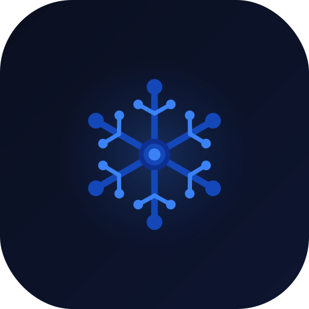

  

 
 

# ZamAI

 

**ZamAI is an AI organization building a growing ecosystem of intelligent products, tools, and digital experiences — home of Zeerak.**  
**ZamAI د مصنوعي هوښیارۍ اداره ده چې د هوښیارو محصولاتو، وسایلو، او ډیجیټلي تجربو مخ پر ودې ایکوسیستم جوړوي — د Zeerak کور.**

---

## About | زموږ په اړه

ZamAI builds intelligent systems, public platforms, and research-driven tools designed to create meaningful real-world impact. Our work connects product development, AI innovation, language technology, and digital experiences under one unified ecosystem.

ZamAI هوښیار سیسټمونه، عامه پلېټفارمونه، او د څېړنې پر بنسټ وسایل جوړوي چې په واقعي نړۍ کې ماناداره اغېز رامنځته کړي. زموږ کار د محصول پراختیا، مصنوعي هوښیاري، ژبنۍ ټکنالوژي، او ډیجیټلي تجربې د یوه متحد ایکوسیستم لاندې سره نښلوي.

We focus on | زموږ تمرکز:
- Building with purpose | د هدف لپاره جوړول
- Shipping with quality | د کیفیت سره وړاندې کول
- Advancing accessible AI | د لاسرسي وړ AI پرمختګ
- Supporting language and culture through technology | د ټکنالوژۍ له لارې د ژبې او کلتور ملاتړ

---

## Projects | پروژې

| Category | Project | What it is | Link |
|---|---|---|---|
| Flagship | **Zeerak** | The flagship AI assistant by ZamAI. Public identity, private-by-choice implementation. | [Repository](https://github.com/ZamAI-ORG/zeerak) |
| Education & Culture | **Cultural Hub** | A public-facing platform for Pashto and Afghan cultural and learning experiences. | [Repository](https://github.com/ZamAI-ORG/cultural-hub) |
| Platform | **ZamAI Web (GitHub Pages)** | The public website and ecosystem hub serving **zamai.dev**. | [Repository](https://github.com/ZamAI-ORG/zamai.github.io) |
| Labs | **Pashto Processing** | Core repository for processing Pashto texts and supporting pipelines. | [Repository](https://github.com/ZamAI-ORG/pashto-processing) |
| Labs | **Pashto Datasets** | Datasets and notebooks supporting Pashto language work. | [Repository](https://github.com/ZamAI-ORG/pashto-datasets) |

---

## ZamAI Labs | ZamAI لابراتوارونه

**ZamAI Labs** is where we publish foundational work that supports the wider ecosystem — including **Pashto** language resources, datasets, processing pipelines, model development, and training systems.

**ZamAI Labs** هغه ځای دی چې موږ پکې بنسټیز کارونه خپروو چې پراخ ایکوسیستم ملاتړ کوي — په کې د **پښتو** ژبې سرچینې، ډېټاسېټونه، د پروسس پایپ لاینونه، ماډل جوړونه، او د روزنې سیسټمونه شامل دي.

These projects help power current and future ZamAI products while advancing language technology and research infrastructure.

دغه پروژې د ZamAI اوسني او راتلونکې محصولات پیاوړي کوي، او هممهاله د ژبنۍ ټکنالوژۍ او څېړنیز بنسټ پرمختګ ته وده ورکوي.

### Explore Labs | لابراتوارونه وپلټئ

- [pashto-processing](https://github.com/ZamAI-ORG/pashto-processing)
- [pashto-datasets](https://github.com/ZamAI-ORG/pashto-datasets)
- [zamai-models](https://github.com/ZamAI-ORG/zamai-models)
- [zamai-training-pipelines](https://github.com/ZamAI-ORG/zamai-training-pipelines)
- [training-spaces](https://github.com/ZamAI-ORG/training-spaces)
- [phi3-mini-pashto-lora](https://github.com/ZamAI-ORG/phi3-mini-pashto-lora)
- [mt5-pashto](https://github.com/ZamAI-ORG/mt5-pashto)
- [zamai-pashto-template](https://github.com/ZamAI-ORG/zamai-pashto-template)

---

## Mission | موخه

To create intelligent, useful, and trustworthy digital solutions that help people, communities, and organizations benefit from modern AI and software.

داسې هوښیار، ګټور، او د باور وړ ډیجیټلي حللارې جوړول چې خلکو، ټولنو، او ادارو ته د معاصر AI او سافټویر له ګټو برخمنېدو کې مرسته وکړي.

## Vision | لید

We believe AI should be practical, accessible, and culturally relevant. ZamAI aims to build technology that empowers users while contributing to a stronger ecosystem of products, tools, and research.

موږ باور لرو چې AI باید عملي، د لاسرسي وړ، او له کلتوري پلوه اړوند وي. ZamAI غواړي داسې ټکنالوژي جوړه کړي چې کاروونکي پیاوړي کړي او د محصولاتو، وسایلو، او څېړنې یو پیاوړی ایکوسیستم رامنځته کړي.

---

## Ecosystem Strategy | د ایکوسیستم تګلاره

- **One brand:** ZamAI | **یو برانډ:** ZamAI
- **One flagship assistant:** Zeerak | **یو مخکښ مرستیال:** Zeerak
- **One public home:** https://zamai.dev | **یو عام کور:** https://zamai.dev
- **Positioning:** **Zeerak by ZamAI** | **موقعیت:** **Zeerak by ZamAI**

This approach creates a clear identity across our ecosystem while allowing each project to serve a distinct role within the broader ZamAI vision.

دا تګلاره زموږ په ایکوسیستم کې روښانه هویت رامنځته کوي، او هرې پروژې ته اجازه ورکوي چې د ZamAI د پراخ لید په چوکاټ کې ځانګړی رول ولوبوي.

---

## Core Values | بنسټیز ارزښتونه

- **Innovation** — We explore new ideas with purpose. | **نوښت** — موږ نوي نظرونه د هدف له مخې لټو.
- **Quality** — We value reliable, maintainable, and well-crafted systems. | **کیفیت** — موږ د باور وړ، د ساتنې وړ، او ښه جوړ شوي سیسټمونه ارزښتمن ګڼو.
- **Impact** — We focus on meaningful outcomes. | **اغېز** — موږ پر مانادارو پایلو تمرکز کوو.
- **Accessibility** — We believe advanced technology should be usable and inclusive. | **لاسرسی** — موږ باور لرو پرمختللې ټکنالوژي باید د کارونې وړ او ټولشموله وي.
- **Continuity** — We build for long-term growth, not short-term visibility. | **دوام** — موږ د اوږدمهاله ودې لپاره جوړوو، نه یوازې لنډمهاله څرګندتیا لپاره.

---

## Contact | اړیکه

© 2026 **ZamAI** · Home of **Zeerak**

